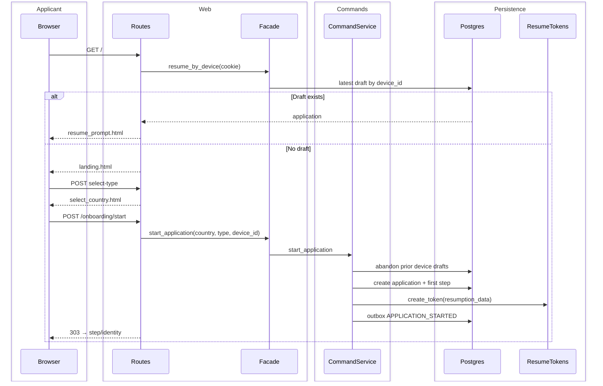
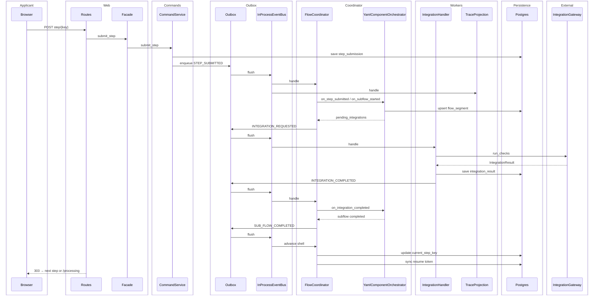
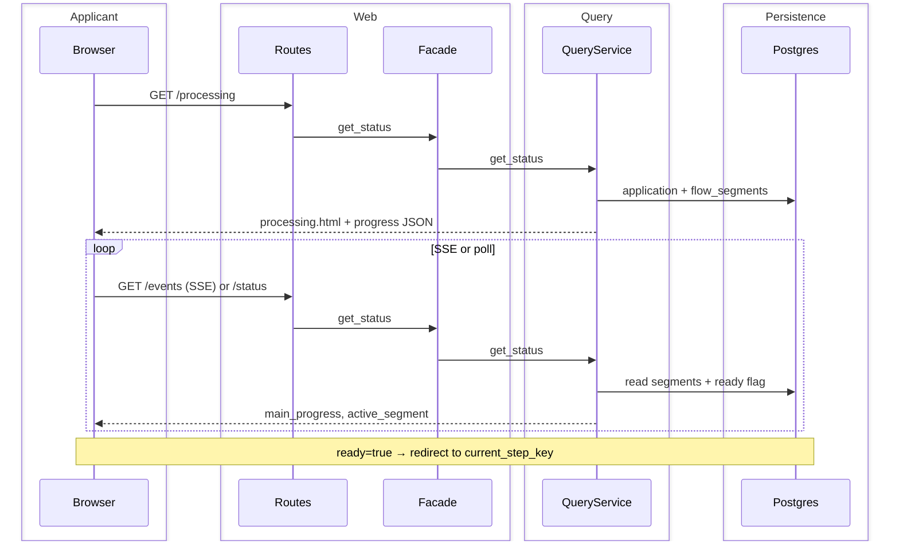
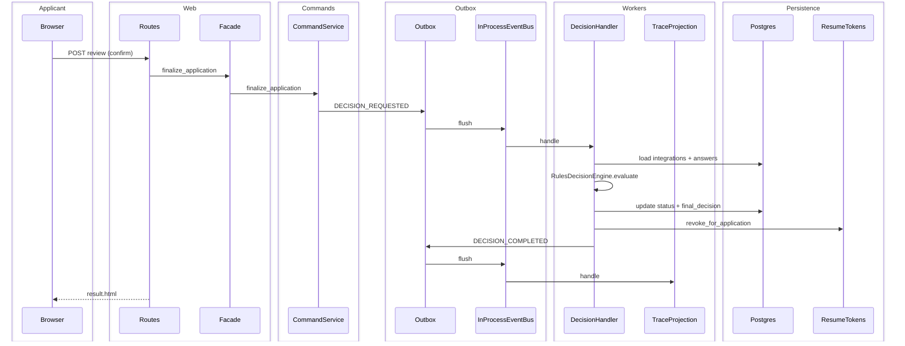
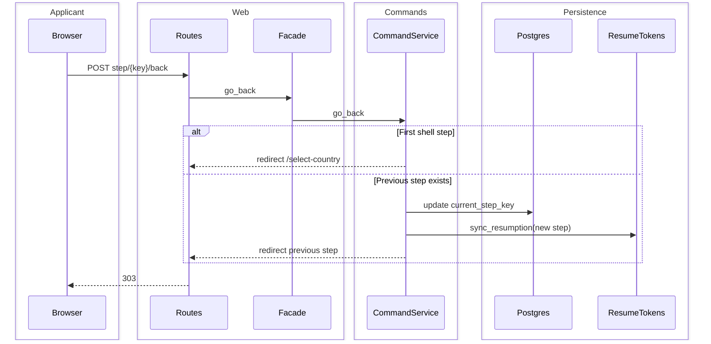
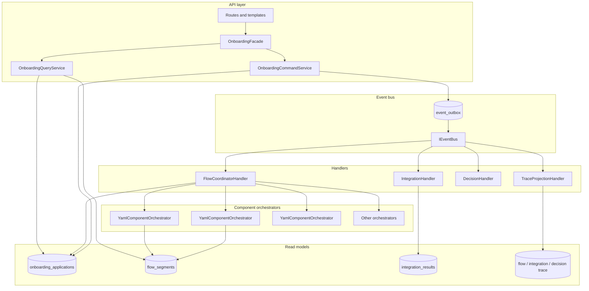
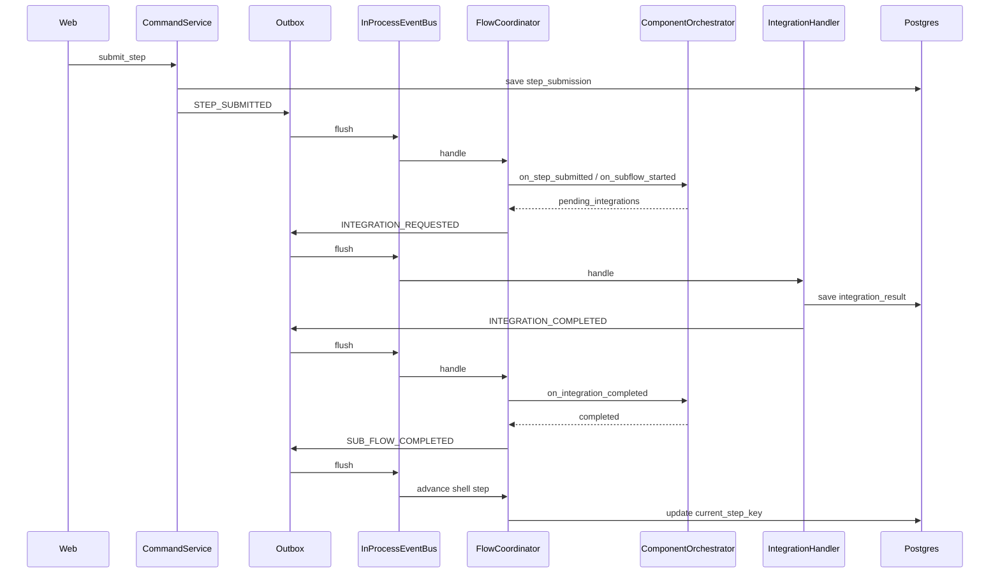
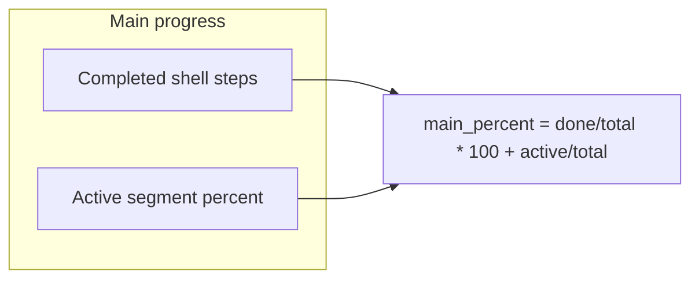

# Architecture

Event-driven onboarding with a **bus-agnostic core**, **transactional outbox**, and a **two-level flow model** (shell + components). The web layer never orchestrates directly — it publishes commands and reads projections.

## Swimlane diagrams

These diagrams show **who does what** across lanes. They complement the component map below and match the current in-process bus + Postgres outbox implementation (handlers are unchanged when the bus becomes AWS-native — see [AWS migration](AWS_MIGRATION.md)).

### 1. Start application (landing → first step)



### 2. Step submit → integration → shell advance (core loop)

Only **FlowCoordinatorHandler** writes `current_step_key`. Component orchestrators update **flow_segments** only.



### 3. Async UX while segment work runs

Today the in-process bus usually finishes before redirect. With a real broker (or slow integrations), the applicant waits on `/processing` while projections catch up.



### 4. Review, decision, and resume token lifecycle



### 5. Go back one step (resume sync)



### Swimlane responsibility matrix

| Lane | Owns | Must not |
|------|------|----------|
| **Applicant / Browser** | Form input, cookies | Advance steps directly |
| **Web / Routes** | HTTP, templates, i18n | Call integrations or change `current_step_key` |
| **CommandService** | Submissions, outbox enqueue, go_back pointer | Render UI |
| **QueryService** | Read models, status, review data | Mutate aggregate |
| **Outbox + Bus** | Durable delivery, handler dispatch | Business rules |
| **FlowCoordinator** | Shell pointer, segment start, integration requests | Shell-level integration calls |
| **Component orchestrator** | Internal step logic inside a segment | Update shell pointer |
| **IntegrationHandler** | External checks, `integration_results` | Advance shell |
| **DecisionHandler** | Final outcome, revoke resume tokens | Change flow YAML |
| **TraceProjection** | Audit tables | Application state |

## High-level view



## Request lifecycle (step submit)



**Important:** `FlowCoordinatorHandler` is the **only** writer of `onboarding_applications.current_step_key`. Component orchestrators update `flow_segments` only.

## Two-level flow model

### Shell flow (`flows/{country}_{type}.yaml`)

Defines **which components run, in what order**, plus UI metadata:

| Field | Required | Purpose |
|-------|----------|---------|
| `key` | yes | Shell step id (e.g. `credit_decision`) |
| `title` | yes | UI heading |
| `orchestrator` | yes* | Registry id (`identity`, `credit`, …) |
| `component_flow` | yes* | Path under `flows/` (e.g. `components/credit/se_private.yaml`) |
| `form_schema` | if form step | Pydantic schema name in `web/forms.py` |
| `on_complete` | yes | Next shell step key |
| `is_review` | review only | Renders review template |
| `triggers_decision` | decision only | Runs decision rules on finalize |

\*Review/decision steps use shared component YAML; form steps need `form_schema`.

### Component flow (`flows/components/{orchestrator}/…`)

Defines **internal steps and integrations** for one capability:

| Field | Purpose |
|-------|---------|
| `component_id` | Stable id (e.g. `se_private_credit`) |
| `orchestrator` | Must match shell `orchestrator` and registry id |
| `internal_steps[]` | Ordered internal work units |
| `internal_steps[].integrations` | Keys routed by `MockIntegrationGateway` |
| `internal_steps[].optional` | Skip internal step without shell change |

All components use `YamlComponentOrchestrator` — **no new Python class** unless behaviour cannot be expressed in YAML.

## Event model

Envelope: `EventEnvelope` (`domain/events/envelope.py`). Types: `EventType` (`domain/events/catalog.py`).

| Event | Publisher | Consumer |
|-------|-----------|----------|
| `STEP_SUBMITTED` | CommandService | FlowCoordinator |
| `SUB_FLOW_STARTED` | Coordinator | Trace |
| `INTEGRATION_REQUESTED` | Coordinator | IntegrationHandler, Trace |
| `INTEGRATION_COMPLETED` | IntegrationHandler | Coordinator, Trace |
| `SUB_FLOW_COMPLETED` | Coordinator | Coordinator (advance), Trace |
| `MAIN_PROGRESS_UPDATED` | Coordinator | Trace, UI projection |
| `DECISION_REQUESTED` | CommandService | DecisionHandler |

Routing keys: `onboarding.{flow_id}.{event}` or `onboarding.component.{orchestrator_id}.{flow_id}.{event}`.

### Transactional outbox

| Piece | Role |
|-------|------|
| `event_outbox` table | Durable event queue |
| `OutboxPublisher` | Enqueue + flush to bus on submit, `/status`, SSE |
| `InProcessEventBus` | Dev/test adapter; pattern subscriptions |

Production: replace `InProcessEventBus` with a broker consumer; handlers stay the same. See [AWS migration guide](AWS_MIGRATION.md) for EventBridge + SQS layout and on-demand scaling.

## Progress model



| Store | Purpose |
|-------|---------|
| `onboarding_applications.current_step_key` | Shell pointer (coordinator only) |
| `flow_segments` | Per-step orchestrator state, internal step, percent, status |

Aggregate formula:

```
main_percent = (completed_shell_steps / total_shell_steps) * 100
             + (active_segment.percent / total_shell_steps)
```

## Module map

| Package | Responsibility |
|---------|----------------|
| `domain/` | Models, enums, `domain/events/` |
| `interfaces/` | Protocols: repo, bus, orchestrator, outbox, segments |
| `flow/` | Shell provider, component provider, engine, orchestrators, progress |
| `events/` | Bus, outbox, handlers, bootstrap |
| `integrations/` | Gateway + mock clients |
| `decision/` | Rules engine + YAML rules |
| `persistence/` | ORM, repos, segments, outbox |
| `services/` | Command, query, facade (+ legacy `OnboardingService`) |
| `web/` | Routes, forms, templates, DI |

## Persistence

| Table | Purpose |
|-------|---------|
| `onboarding_applications` | Application aggregate |
| `step_submissions` | Form answers per shell step |
| `integration_results` | Check outcomes |
| `flow_segments` | Component progress projection |
| `event_outbox` | Transactional outbox |
| `flow_trace`, `integration_trace`, `decision_trace` | Audit projections |
| `resume_tokens` | Token-based resume |

Migrations: `alembic/versions/` (001–007).

## Async applicant UX

| Endpoint | Returns |
|----------|---------|
| `GET /onboarding/{id}/status` | `ready`, `main_progress`, `active_segment`, `segments[]` |
| `GET /onboarding/{id}/events` | SSE stream |
| `GET /onboarding/{id}/processing` | Polling page |

In-process bus completes synchronously on submit; `/processing` mainly matters when a real async broker is introduced.

## Dependency injection

`web/deps.py` wires per-request Postgres session, builds event bus + handlers, returns `OnboardingFacade`.

`main.py` lifespan registers `OrchestratorRegistry` on `app.state`.

Tests: `build_event_facade()` (in-memory) or `build_postgres_facade()` (Postgres e2e).

## Feature flag

`Settings.event_driven_enabled` (default `true`):

- **true** — Command/query facade, outbox, coordinator (recommended)
- **false** — Legacy sync `OnboardingService` (deprecated; shell YAML is component-oriented)

## Tradeoffs

| Choice | Rationale |
|--------|-----------|
| Shell + component YAML | Add/remove capabilities without monolithic flow edits |
| In-process bus + outbox | No background worker on Vercel; flush on request |
| Postgres read models | Simpler than full event sourcing |
| Monorepo handlers | Extract to Lambdas / consumer groups later |
| Generic YamlComponentOrchestrator | One implementation; YAML drives behaviour |

## Security (demo)

- No auth, no rate limits
- Resume tokens: UUID + TTL (production: HMAC / hash at rest)
- Device cookie: HttpOnly, SameSite=Lax
- PII redacted in trace metadata
