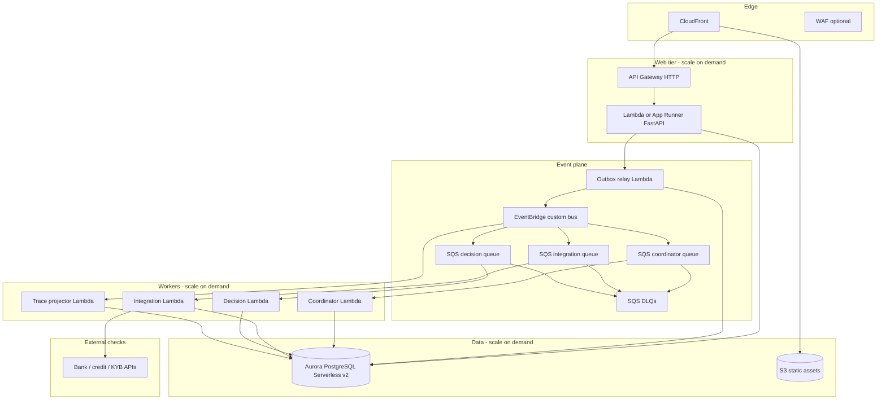
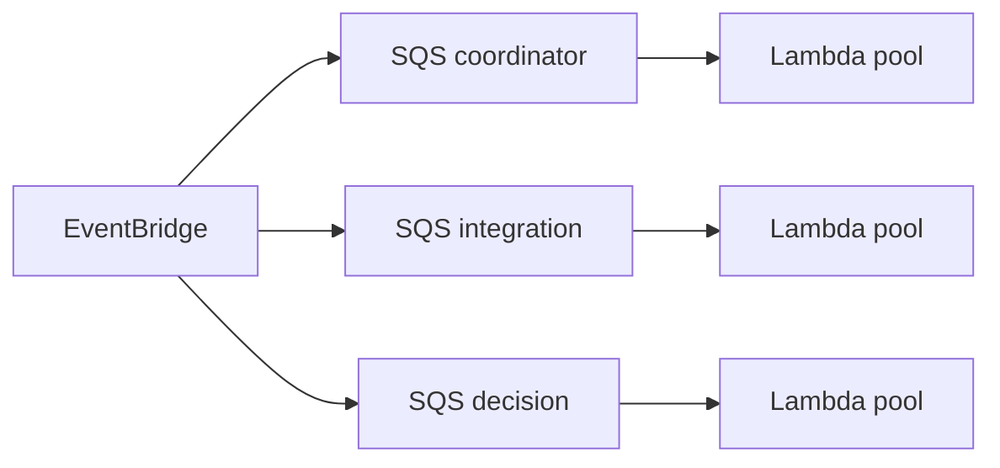

# AWS-native migration guide

This document explains how to migrate the onboarding platform from the current **FastAPI + Postgres outbox + in-process event bus** layout to **AWS-native, on-demand scaling** components — without rewriting domain logic, YAML flows, or event handlers.

For how components interact today, see swimlane diagrams in [ARCHITECTURE.md](ARCHITECTURE.md).

## Design principle

The codebase is already structured for this move:

| Layer | Migration impact |
|-------|------------------|
| `domain/`, `interfaces/` | **No change** — protocols stay the same |
| `flow/`, `decision/`, YAML under `flows/` | **No change** |
| Event **handlers** (`events/handlers/*`) | **Minimal** — same classes, different bus adapter |
| `OutboxPublisher` + `event_outbox` | **Relay change** — async flush instead of in-request |
| `InProcessEventBus` | **Replace** with EventBridge / SQS |
| `web/` routes & templates | **Deploy target change** — Lambda, App Runner, or ECS |
| Mock integrations | **Replace** with real adapters (Lambda, API Gateway, partners) |

Handlers subscribe to routing keys like `onboarding.se_private.step.submitted`. On AWS, publish the same envelope JSON to EventBridge; route by `detail-type` / `source` to SQS queues consumed by the same handler code.

---

## Target architecture (AWS)



---

## Component mapping

| Current (demo) | AWS-native | Notes |
|----------------|------------|-------|
| FastAPI on Vercel / uvicorn | **App Runner** or **Lambda + Mangum** behind **API Gateway HTTP API** | App Runner = least refactor for monolith; Lambda = finest per-request scale |
| `public/` static files | **S3** + **CloudFront** | Same CSS; optional origin for `/static` |
| Docker Postgres / Neon | **Aurora PostgreSQL Serverless v2** | Same schema; Alembic migrations in CI/CD |
| `event_outbox` table | Same table + **Outbox Relay Lambda** | Relay polls or listens; publishes to EventBridge |
| `InProcessEventBus` | **Amazon EventBridge** custom event bus | One bus per env (`onboarding-prod`) |
| Handler dispatch | **EventBridge rules → SQS** → Lambda | One queue per handler group for independent scaling |
| `IntegrationHandler` + mocks | **Integration Lambda** + **Secrets Manager** | One fat Lambda initially; split by `integration_key` later |
| SSE `/events` | **API Gateway WebSocket** or **short poll** on `/status` | Poll + Aurora read is simplest first step |
| Resume tokens in Postgres | Same table | Optional: **DynamoDB** TTL table for high-volume tokens |
| Admin `/admin` | Same app behind **IP allow list** or **Cognito** | Not public in production |
| Logs / traces | **CloudWatch Logs** + **X-Ray** | Correlate on `request_id` / `correlation_id` |
| Config / markets / i18n | **SSM Parameter Store** or bake into container | YAML in repo is fine with blue/green deploy |

---

## Migration phases

### Phase 0 — Lift database (low risk)

1. Provision **Aurora Serverless v2** (min ACU 0.5, max per peak).
2. Run `alembic upgrade head` from CI.
3. Point `DATABASE_URL` at Aurora; keep current app hosting unchanged.
4. Enable **RDS Proxy** if Lambda concurrency will hammer connections.

**Scaling:** Aurora scales **ACUs** up/down automatically based on CPU/connections. You pay for capacity used, not provisioned instances.

### Phase 1 — Decouple outbox flush (enable async)

Today `OutboxPublisher.enqueue_and_flush` runs handlers **inside the HTTP request**. On AWS, HTTP should only **write** to Postgres + outbox.

1. Change web command path to **enqueue only** (no in-process flush).
2. Deploy **Outbox Relay Lambda**:
   - Trigger: EventBridge schedule every 1–5 s *or* RDS **Logical replication** / **DMS** (advanced).
   - Action: `SELECT … FROM event_outbox WHERE published_at IS NULL FOR UPDATE SKIP LOCKED`, publish to EventBridge, mark published.
3. Applicant flow redirects to `/processing` when `get_status().ready == false`.

**Scaling:** Relay Lambda concurrency is low (1–10). Bottleneck moves to worker Lambdas, not web.

### Phase 2 — EventBridge + SQS workers

1. Create custom bus: `onboarding`.
2. Rules (examples):

| Rule | Pattern | Target |
|------|---------|--------|
| coordinator | `detail-type` matches `*step.submitted*`, `*integration.completed*`, `*subflow.completed*` | SQS `onboarding-coordinator` |
| integration | `detail-type` matches `*integration.requested*` | SQS `onboarding-integration` |
| decision | `detail-type` matches `*decision.requested*` | SQS `onboarding-decision` |
| trace | `source` = `onboarding` | SQS `onboarding-trace` (or direct Lambda) |

3. Package existing handler classes in Lambda containers (shared Docker image with `handlers/` + deps).
4. Wire **partial batch failure** reporting on SQS → DLQ after N retries.

**Scaling:** Each queue scales **independently**:

```
Integration queue depth high → increase Integration Lambda max concurrency
Coordinator quiet → coordinator Lambdas scale to zero between bursts
```

### Phase 3 — Real integrations

Replace `MockIntegrationGateway` with provider clients:

| Integration key | Typical AWS pattern |
|-----------------|---------------------|
| `bankid_identity`, `pesel_eid_check` | Lambda in VPC → partner API via **PrivateLink** or NAT |
| `credit_bureau`, `bik_credit` | Same; secrets in **Secrets Manager** |
| `sanctions_screen` | Batch-friendly: **Step Functions** map state for UBO lists |
| Long-running KYB | **Step Functions** standard workflow; completion event → `INTEGRATION_COMPLETED` |

Keep **`INTEGRATION_REQUESTED` / `INTEGRATION_COMPLETED`** events identical so the coordinator does not change.

### Phase 4 — Edge, auth, compliance

- **CloudFront** + WAF in front of API and static assets.
- **Cognito** or bank IdP for admin; applicant flows remain cookie + resume token until strong auth is required.
- **KMS** encryption at rest for Aurora; **Secrets Manager** rotation for API keys.
- **CloudTrail** + audit: trace tables remain source for ops; ship to **OpenSearch** if needed.

---

## On-demand scaling model

The platform has **three independently scalable tiers**. None require pre-provisioned capacity for idle traffic.

### 1. Web tier (read-heavy, short writes)

| Option | Scales when | Best for |
|--------|-------------|----------|
| **Lambda** (Mangum) | Each HTTP request | Spiky traffic, pay per ms |
| **App Runner** | Request count + CPU | Minimal code change, always-warm option |
| **ECS Fargate** + ALB | CPU / request count target tracking | Long-lived connections, WebSocket |

**Recommendation:** Start with **App Runner** (single container from `main.py`). Move hot paths to Lambda later if cost/latency requires it.

Auto scaling policy example (App Runner):

- Min instances: 1 (or 0 if supported in your region for cost)
- Max instances: 20
- Scale on: concurrent requests > 80 per instance

### 2. Worker tier (event-driven)



| Knob | Effect |
|------|--------|
| **SQS batch size** | Throughput vs latency per invocation |
| **Lambda reserved concurrency** | Cap noisy integration workers |
| **Lambda max concurrency** | Upper bound per queue (account limit applies) |
| **EventBridge replay** | Reprocess DLQ after fixes |

**Integration lane** is usually the slowest (external APIs). Scale **`onboarding-integration` queue consumers** separately from coordinator:

- Coordinator: small, fast, high churn during form steps.
- Integration: few messages per step but seconds each — **scale max concurrency** on integration Lambdas, not web.

### 3. Data tier (Aurora Serverless v2)

| Metric | Aurora response |
|--------|-----------------|
| Connection spike | Scale ACUs; add **RDS Proxy** |
| Read-heavy `/status` polling | **Reader endpoint** for QueryService reads |
| Write burst (outbox + segments) | Writer ACU scale-up (seconds) |

Set **min ACU** for production to avoid cold-start latency on first request after idle; use **0.5–1 ACU** for dev/test.

### End-to-end scaling story (example)

1. Marketing campaign → 500 applicants/min hit **CloudFront → API Gateway → App Runner** (web tier scales out).
2. Each step submit inserts one outbox row; relay publishes ~500 events/min to EventBridge.
3. **Coordinator queue** depth rises briefly; Lambda adds concurrent executions (up to configured max).
4. **Integration queue** receives 2–3× more messages (multiple checks per step); integration Lambdas scale separately — **this is the usual first bottleneck**.
5. Aurora ACUs increase with write/read load; scale down after queue depth returns to zero.

**Cost profile:** Pay for web compute during requests, worker compute during queue depth, Aurora ACUs during active minutes — **no fixed worker fleet**.

---

## Outbox relay pattern (reference)

Pseudo-flow for the relay Lambda (replaces in-process flush):

```python
# Pseudocode — not in repo
async def handler(event, context):
    rows = await outbox.fetch_pending(limit=100)
    for row in rows:
        await eventbridge.put_events(
            Entries=[{
                "Source": "onboarding",
                "DetailType": row.envelope.event_type.value,
                "Detail": row.envelope.model_dump_json(),
                "EventBusName": "onboarding-prod",
            }]
        )
        await outbox.mark_published(row.id)
```

Web command path becomes:

```python
await outbox.enqueue(envelope)  # same DB transaction as step save
await session.commit()
# return 303 → /processing — no handler runs in request
```

---

## SSE and `/processing` on AWS

| Approach | Pros | Cons |
|----------|------|------|
| **Poll `/status`** every 1–2 s | Works with App Runner; no WebSocket infra | Slightly higher read load |
| **API Gateway WebSocket** | True push | Connection management, auth |
| **AppSync subscriptions** | Managed real-time | Extra service |

**Pragmatic first step:** Keep polling/SSE endpoint on App Runner; optimize with Aurora reader + short cache on `get_status` if needed.

---

## What to deploy as one unit vs split

| Deploy unit | Rationale |
|-------------|-----------|
| **Web** (routes + query + command enqueue) | Low latency to user; no heavy integrations |
| **Coordinator worker** | Fast; must stay near DB |
| **Integration worker** | Slow; different timeout (30–120 s); VPC |
| **Decision worker** | CPU-light; runs once per application |
| **Outbox relay** | Single-purpose; scheduled |

All can share one **ECR image** with different `CMD` / handler entrypoints to reduce build sprawl.

---

## Observability and operations

| Concern | AWS tool | Correlation field |
|---------|----------|-------------------|
| Request tracing | X-Ray | `request_id` |
| Event tracing | EventBridge archive + CloudWatch Logs | `correlation_id` |
| Failed handlers | SQS DLQ + alarm | `application_id` |
| Business audit | Existing trace tables | unchanged |
| Dashboards | CloudWatch | queue depth, Lambda errors, Aurora ACUs |

**Idempotency:** Handlers should tolerate duplicate SQS delivery (check `integration_results` uniqueness, segment state before re-run).

---

## Environment layout

| Environment | Bus | Aurora | Workers |
|-------------|-----|--------|---------|
| dev | `onboarding-dev` | min ACU 0.5 | max concurrency 5 |
| staging | `onboarding-staging` | min ACU 1 | mirrors prod rules |
| prod | `onboarding-prod` | min ACU 2+, multi-AZ | reserved concurrency on integration |

Use **separate AWS accounts** or at minimum separate buses and Aurora clusters per environment.

---

## Checklist before cutover

- [ ] Outbox relay running; no in-request handler flush in production
- [ ] All EventBridge rules tested with recorded envelopes from `event_outbox`
- [ ] DLQ alarms configured; runbook for replay
- [ ] RDS Proxy in front of Aurora for Lambda workers
- [ ] Secrets Manager for partner credentials; no keys in Lambda env plain text
- [ ] `/processing` + `/status` tested under 30 s integration latency
- [ ] Alembic migrations in CI/CD before app deploy
- [ ] Load test: integration queue depth recovers without manual scaling

---

## Related docs

- [ARCHITECTURE.md](ARCHITECTURE.md) — swimlanes, event catalog, module map
- [FLOWS_GUIDE.md](FLOWS_GUIDE.md) — adding markets and YAML flows (unchanged on AWS)
- [README.md](../README.md) — local run and test commands
