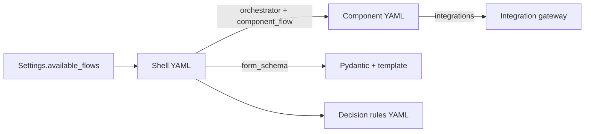

# Flows guide — adding countries, shell flows, and component sub-flows

This guide explains how to extend onboarding **without breaking** the event-driven architecture. Read [ARCHITECTURE.md](ARCHITECTURE.md) first for the coordinator / segment model.

## Concepts

| Layer | Location | You define |
|-------|----------|------------|
| **Shell flow** | `flows/{cc}_{type}.yaml` | Step order, titles, forms, which component runs |
| **Component flow** | `flows/components/{orchestrator}/…` | Internal steps, integrations, optional branches |
| **Form schema** | `src/onboarding/web/forms.py` | Validation for applicant input |
| **Form template** | `templates/partials/forms/` | HTML fields (must match schema) |
| **Decision rules** | `src/onboarding/decision/rules/{flow_id}.yaml` | Approve / reject / manual review |
| **Configuration** | `src/onboarding/config.py` | Country allow-list, feature flags |



---

## Registered orchestrators

These ids are valid in shell `orchestrator:` and component `orchestrator:` fields (`OrchestratorRegistry`):

| Orchestrator id | Typical shell step | Notes |
|-----------------|-------------------|--------|
| `identity` | `identity` | BankID / DNI / PESEL checks |
| `contact` | `contact` | Usually no integrations |
| `compliance` | `consent` | Sanctions / PEP |
| `affordability_input` | `financial` (private) | Collects income/expenses |
| `financial` | `financial` (business) | Business financials |
| `credit` | `credit_decision` | Bureau + affordability |
| `kyb` | `kyb_decision` | Business KYB |
| `bank` | `bank_verification` | IBAN verify (ES/PL business) |
| `company` | `company` | Registry lookup |
| `signatory` | `signatory` | SE business |
| `representative` | `representative` | ES business |
| `board` | `board` | PL business |
| `ubo` | `ubo` | UBO KYC |
| `review` | `review` | Confirmation only |
| `decision` | `decision` | Triggers rules engine |

New orchestrator ids auto-register at runtime, but you should add them to `register_defaults()` in `registry.py` for clarity.

---

## Valid integration keys

Use **only** keys known to `INTEGRATION_MAP` in `integrations/gateway.py`:

| Key | Check type | Typical use |
|-----|------------|-------------|
| `bankid_identity` | identity | SE |
| `dni_nie_check` | identity | ES |
| `pesel_eid_check` | identity | PL |
| `address_lookup` | address | Contact |
| `bolagsverket_registry` | registry | SE company |
| `registro_mercantil` | registry | ES company |
| `ceidg_krs_registry` | registry | PL company |
| `signatory_check` | signatory | SE |
| `ubo_kyc` | ubo | All business |
| `sanctions_screen` | sanctions | Compliance |
| `credit_bureau` | credit | SE/ES credit |
| `bik_credit` | credit | PL credit |
| `affordability` | affordability | Private credit |
| `kyb_check` | kyb | Business KYB |
| `iban_verify` / `bank_verify` | bank_account | Bank verification |

Adding a **new integration key** requires updating `INTEGRATION_MAP`, gateway routing logic, and usually a mock client.

---

## Scenario A — New country for an existing pattern

Example: add **NO private** modeled on SE private.

### 1. Domain enum

```python
# src/onboarding/domain/enums.py
class Country(str, Enum):
    ...
    NO = "NO"
```

### 2. Shell flow

Create `flows/no_private.yaml`:

```yaml
flow_id: no_private
country: NO
account_type: private
steps:
  - key: identity
    title: "Verify identity"
    orchestrator: identity
    component_flow: components/identity/no_private.yaml   # new component
    form_schema: IdentityStepNO                          # new schema
    on_complete: contact
  - key: contact
    title: "Contact details"
    orchestrator: contact
    component_flow: components/contact/default.yaml     # reuse
    form_schema: ContactStep
    on_complete: consent
  # … mirror se_private shell steps …
  - key: decision
    title: "Decision"
    orchestrator: decision
    component_flow: components/decision/default.yaml
    triggers_decision: true
```

**Rules:**

- `flow_id` must be `{country_lowercase}_{account_type}` and match the filename stem.
- Every step needs `on_complete` except the last (`decision` may omit if terminal).
- `orchestrator` on shell must match `orchestrator` inside the referenced component YAML.
- `component_flow` path is relative to `flows/`.

### 3. Component YAML (market-specific)

Create `flows/components/identity/no_private.yaml`:

```yaml
component_id: no_private_identity
orchestrator: identity
internal_steps:
  - key: id_verify
    title: "National ID verification"
    integrations: [bankid_identity]    # or new key if you add gateway support
  - key: complete
```

Reuse shared components where possible (`contact/default.yaml`, `decision/default.yaml`).

### 4. Form schema + template

```python
# src/onboarding/web/forms.py
class IdentityStepNO(BaseModel):
    national_id: str = Field(min_length=11)
    full_name: str = Field(min_length=2)
    date_of_birth: str

FORM_SCHEMAS["IdentityStepNO"] = IdentityStepNO
```

Add template branch in `templates/step.html` and create `templates/partials/forms/identity_no.html`.

### 5. Decision rules

Create `src/onboarding/decision/rules/no_private.yaml`:

```yaml
flow_id: no_private
critical_checks: [identity, address, sanctions, credit, affordability]
min_credit_score: 550
```

`critical_checks` values map to `IntegrationCheckType` outcomes stored in `integration_results`.

### 6. Enable market + locale

Edit `i18n/markets.yaml`:

```yaml
markets:
  NO:
    locale: nb
    bundle: NO
    enabled:
      private: true
      business: true
```

`Settings.available_flows` is derived automatically from enabled flags.

### 7. Translation bundle

Create `i18n/bundles/NO.yaml` with UI strings (copy `en.yaml` as template). The app uses the application's country to pick the bundle after onboarding starts; pre-country pages use the default `en` bundle.

### 8. Tests

- Add shell step list to `tests/unit/test_flow_engine.py` parametrize (if new pattern).
- Run happy-path integration test or extend `tests/integration/test_event_driven_flow.py`.
- `pytest -m postgres` after Docker is up.

---

## Scenario B — New shell step in an existing market

Example: add **document_upload** between `consent` and `financial` for SE private only.

### 1. Create component (if new capability)

`flows/components/documents/se_private.yaml`:

```yaml
component_id: se_private_documents
orchestrator: documents
internal_steps:
  - key: collect
    title: "Document collection"
  - key: complete
```

Register `documents` in `OrchestratorRegistry.register_defaults()`.

### 2. Insert shell step

Edit `flows/se_private.yaml`:

```yaml
  - key: consent
    ...
    on_complete: document_upload          # was: financial
  - key: document_upload
    title: "Upload documents"
    orchestrator: documents
    component_flow: components/documents/se_private.yaml
    form_schema: DocumentUploadStep       # if applicant input needed
    on_complete: financial
  - key: financial
    ...
```

**Do not** add integrations to shell steps — integrations belong in **component** YAML.

### 3. Wire form (if needed) + tests

Only SE shell changes; ES/PL private flows are untouched.

---

## Scenario C — Change integrations inside a component only

Example: remove affordability from SE private credit (product variant).

Edit **only** `flows/components/credit/se_private.yaml`:

```yaml
component_id: se_private_credit
orchestrator: credit
internal_steps:
  - key: bureau_pull
    integrations: [credit_bureau]
  - key: complete
```

Shell `flows/se_private.yaml` stays the same. Coordinator still delegates to `credit` orchestrator; segment progress reflects fewer internal steps.

---

## Scenario D — New business market (full shell)

Copy nearest neighbour:

| Target | Copy from |
|--------|-----------|
| NO business (Nordic) | `se_business.yaml` + components |
| New EU business | `es_business.yaml` |
| New PL-style business | `pl_business.yaml` |

Adjust: company/signatory/board/representative components, registry integration keys, bank verification step (ES/PL include `bank_verification`; SE does not).

---

## Configuration checklist

Use this before opening a PR:

- [ ] `flows/{flow_id}.yaml` — shell loads (`YamlFlowDefinitionProvider` only loads `flows/*.yaml`, not subfolders)
- [ ] All `component_flow` paths exist under `flows/`
- [ ] `orchestrator` ids match between shell and component
- [ ] `form_schema` registered in `FORM_SCHEMAS` and wired in `step.html`
- [ ] Template partial exists for new forms
- [ ] Integration keys exist in `INTEGRATION_MAP`
- [ ] Decision rules file matches `flow_id`
- [ ] `Country` enum updated (new country)
- [ ] Entry in `i18n/markets.yaml` with `enabled` flags + locale/bundle
- [ ] Translation bundle `i18n/bundles/{country}.yaml`
- [ ] `pytest` passes (`pytest -m "not postgres"` minimum)
- [ ] Optional: `pytest -m postgres` with Docker

---

## File naming conventions

| Artifact | Pattern | Example |
|----------|---------|---------|
| Shell flow | `flows/{cc}_{type}.yaml` | `flows/se_private.yaml` |
| Component | `flows/components/{orchestrator}/{market}.yaml` | `components/credit/se_private.yaml` |
| Shared component | `flows/components/{orchestrator}/default.yaml` | `components/contact/default.yaml` |
| Decision rules | `src/onboarding/decision/rules/{flow_id}.yaml` | `rules/se_private.yaml` |
| Translations | `i18n/bundles/{country}.yaml` | `bundles/SE.yaml` |
| Market config | `i18n/markets.yaml` | enabled + locale per country |
| Form partial | `templates/partials/forms/{name}.html` | `identity_se.html` |

---

## What NOT to do

| Anti-pattern | Why |
|--------------|-----|
| Put `integrations:` on shell steps | Integrations run inside components via event bus |
| Write `current_step_key` outside coordinator | Causes desync with segments |
| Skip `on_complete` links | Breaks shell navigation |
| Mismatch `orchestrator` shell vs component | Coordinator cannot delegate |
| Invent integration keys without gateway support | Silent fallback or runtime errors |
| Edit plan files or unrelated orchestration | Keep changes scoped to YAML + forms + rules |
| Remove `complete` internal step | Component never finishes |

---

## Local verification

```bash
# Start stack
docker compose up -d postgres
alembic upgrade head
uvicorn main:app --reload --port 8001

# Automated
pytest -m "not postgres"
pytest -m postgres

# Manual
# 1. POST /onboarding/start with new country
# 2. Walk each shell step
# 3. GET /onboarding/{id}/status — check segments
# 4. /admin/applications/{id} — segment breakdown + traces
```

---

## LLM-assisted changes

For AI-assisted edits, always attach **[.cursor/skills/onboarding-flows/SKILL.md](../.cursor/skills/onboarding-flows/SKILL.md)**. It contains the rulebook and validation checklist agents must follow.
